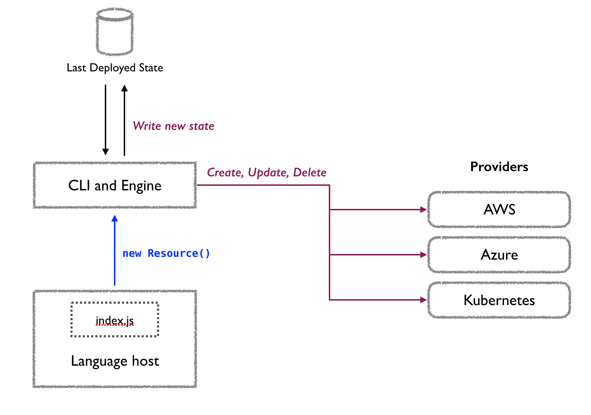

# Declarative Dotnet DevOps Demo

_.Net Oxford Meetup Feb 2024 Lightning talk_

## No love for YAML?

**Why not C#?**

## How it works

## Demo Steps

Requirements:

- .NET
- Pulumi
- Docker
- Azure CLI/Authentication details

Steps:

1. `cd infra`
2. `pulumi up` - select yes

Clean-up: `pulumi destroy`
